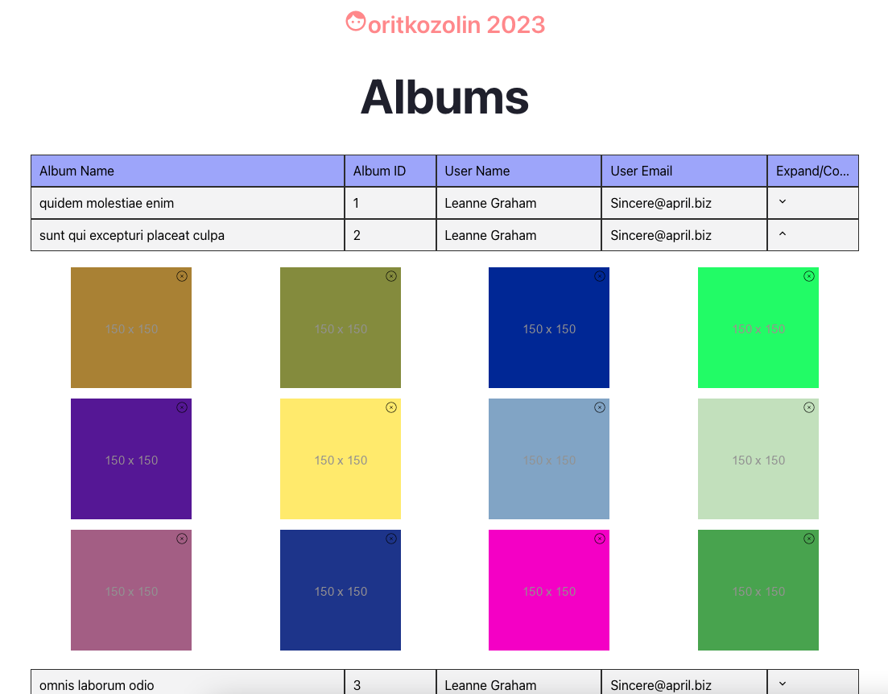

# Photo album
show photo albums. fetch data via api. react typescript project

What is does:

1. Fetch a list of all albums from the test API.
2. Show a list of the fetched albums. Decide on a design.
3. Every album record should display album name, album id, and its user's name and email address. In addition, every record shows an expand / collapse toggle image.
4. A click on the expand button will fetch the album's photos and display a set of only 12 of them on a screen. Only thumbnail images to be displayed, in a way of a visual grid of 3 rows, 4 images in each. Don't use a table component to display photos, use css only.
5. Each image will have a "x" button at the top right corner. Clicking on this button will remove the photo from the grid and reorder the rest of photos to reduce the empty room of the removed one.
6. On hover of a thumbnail, show its title. Decide on the visual design.
7. On click on a thumbnail, show a popup with a corresponding full size image. At the top right corner of the full size image, place an "x" button which will close the image on click.
8. On click on the collapse button of the expanded album, close the photos area. On next click on the expand button to refresh photos from the API, so if some photos were removed before, all of them should be displayed again.
9. Allow reordering of expanded photos by dragging and dropping any of them. Dropping an image between two adjacent images will reorder images to place the dropped one between the two. It's recommended to use react-beautiful-dnd for that, though not mandatory.
## Available Scripts

In the project directory, you can run:

### `npm start`

Runs the app in the development mode.\
Open [http://localhost:3000](http://localhost:3000) to view it in the browser.

The page will reload if you make edits.\
You will also see any lint errors in the console.

### `npm test`

Launches the test runner in the interactive watch mode.\
See the section about [running tests](https://facebook.github.io/create-react-app/docs/running-tests) for more information.

### `npm run build`

Builds the app for production to the `build` folder.\
It correctly bundles React in production mode and optimizes the build for the best performance.

The build is minified and the filenames include the hashes.\
Your app is ready to be deployed!

See the section about [deployment](https://facebook.github.io/create-react-app/docs/deployment) for more information.

### `npm run eject`

**Note: this is a one-way operation. Once you `eject`, you can’t go back!**

If you aren’t satisfied with the build tool and configuration choices, you can `eject` at any time. This command will remove the single build dependency from your project.

Instead, it will copy all the configuration files and the transitive dependencies (webpack, Babel, ESLint, etc) right into your project so you have full control over them. All of the commands except `eject` will still work, but they will point to the copied scripts so you can tweak them. At this point you’re on your own.

You don’t have to ever use `eject`. The curated feature set is suitable for small and middle deployments, and you shouldn’t feel obligated to use this feature. However we understand that this tool wouldn’t be useful if you couldn’t customize it when you are ready for it.

## Learn More

You can learn more in the [Create React App documentation](https://facebook.github.io/create-react-app/docs/getting-started).

To learn React, check out the [React documentation](https://reactjs.org/).
